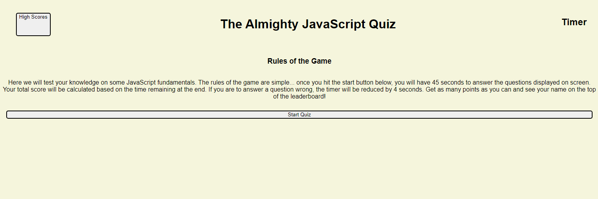

# 04 Web APIs: Code Quiz
## Module 4 Challenge

## Description
The goal of this challenge was to create a timed quiz on JavaScript fundaments that will store high scores to see past results. The quiz had to meet a series of criteria which included:
* Upon the click of a start button --> You are presented with a question and the timer starts
* Once answering a question, the next one appears
* If the user answers a question incorrectly, time is subtracted from the timer
* When all the questions are answered or the timer reaches 0, the game ends
* Upon game end, your score is shown as well as a form to input your initials and store your score

## Screenshot

## Website
This [link](https://tyomoto.github.io/cuddly-guide/) will take you to deployed application on github pages.

